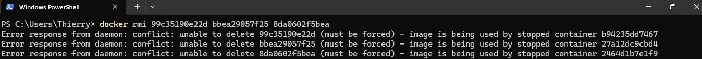
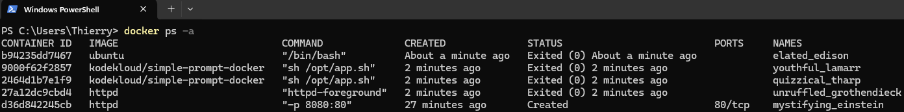
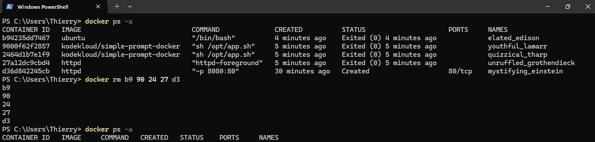

# Exercice 2 - Démarrer un conteneur Docker

L'image **simple-prompt-docker** de la registry **kodekloud** est une image Docker qui effectue les actions suivantes :

- affichage du texte **Welcome! Please enter your name:**
- récupération des inputs de l'entrée standard du conteneur (stdin)
- affichage du texte **Hello and Welcome {inputs-entrée-standard} !**
- arrêt du conteneur

## 1. La commande docker images

La commande **docker images** permet de lister les images présentes sur le Docker Host. Exécutez la commande `docker images` :

Notez la présence de la version **latest** de l'image **httpd** qui a été téléchargée et utilisée pour lancer le conteneur de l'exercice 1.

Vous pouvez également noter sa présence dans l'interface graphique de Docker Desktop (onglet Images) :

## 2. Le mode non-intéractif

Exécutez la commande `docker run kodekloud/simple-prompt-docker` : 

Notez que :

- docker télécharge l'image **simple-prompt-docker** depuis la registry **kodekloud**
- docker lance un conteneur qui effectue les actions de l'image avec un stdin vide, puis arrête le conteneur

En effet, un conteneur lancé en mode non-intéractif (sans l'option -i) ne dispose pas d'entrée standard :

Exécutez la commande `docker images` :

Notez la présence de la version **latest** de l'image **simple-prompt-docker** téléchargée précédemment.

Faîtes de même sur l'interface graphique de Docker Desktop :

## 2. Le mode intéractif

Exécutez à présent la commande `docker run -i kodekloud/simple-prompt-docker` et renseignez le nom de votre choix lorsque demandé :

Notez que :

- docker ne télécharge pas l'image **simple-prompt-docker** depuis la registry **kodekloud**
- docker lance un conteneur qui effectue les actions de l'image avec l'input que vous avez fourni, puis arrête le conteneur

En effet, un conteneur lancé en mode intéractif (avec l'option -i) utilise l'entrée standard du Docker Host :

## 3. Le mode terminal

Démarrez un conteneur ubuntu en mode intéractif et en **mode terminal** avec la commande `docker run -it ubuntu` :

Notez que votre prompt est maintenant celui du terminal du conteneur. La série alphanumérique qui suit "root@" est l'ID du conteneur.

En effet, un conteneur lancé en mode terminal "mappe" celui du Docker Host avec celui du conteneur :

Exécutez les commandes `pwd` puis `ls` pour respectivement identifier le répertoire courant et lister les fichiers et dossiers qui s'y trouvent :

Exécutez la commande `exit` pour sortir du conteneur, puis la commande `docker ps` pour constater que le conteneur a été arrêté suite à votre sortie.

## 4. Le port-mapping

Lors de l'exercice 1, vous avez lancé un conteneur httpd mais il n'existait aucun moyen d'accéder à l'application qu'il hébergeait. En effet, il est nécessaire d'effectuer du **port-mapping** pour accéder à l'application hébergée par un conteneur.

Pour rappel, le port-mapping permet de "mapper" un port du Docker Host avec le port du conteneur que son application écoute :

Exécutez la commande `docker run -p 8080:80 httpd` pour lancer un conteneur httpd en mappant le **port 8080 du Docker Host** avec le **port 80 du conteneur** :

Ouvrez une nouvelle fenêtre de termial et exécutez la commande `docker ps` pour observer les informations affichées sur ce conteneur :

Notez que le port-mapping configuré est affiché dans la colonne PORTS.

Ouvrez maintenant le navigateur de votre choix et accédez à l'URL http://localhost:8080 pour accéder à l'application hébergée par le conteneur :

## 5. Suppression des images

La commande **docker rmi** permet de supprimer une image présente sur un Docker Host.

Exécutez la commande `docker images` et identifiez l'ID de chaque image présente sur votre poste :

Supprimez les images en exécutant la commande `docker rmi {ID-image-httpd} {ID-image-simple-prompt-docker} {ID-image-ubuntu}` :

Docker vous indique qu'il ne peut pas supprimer les images car elles sont utilisées par des conteneurs arrêtés.

Exécutez la commande `docker ps -a` :

L'argument **-a** permet d'ajouter les conteneurs arrêtés à la liste des conteneurs affichés par docker ps.

Exécutez la commande **docker rm** pour supprimer les conteneurs arrêtés qui utilisent les images httpd et simple-prompt-docker :

Notez qu'il est possible d'indiquer des IDs partiels à la commande docker rm. Tout conteneur dont l'ID match avec un des IDs partiels fournis sera supprimé.

Supprimez maintenant les images httpd et simple-prompt-docker à l'aide de la commande **docker rmi** :

